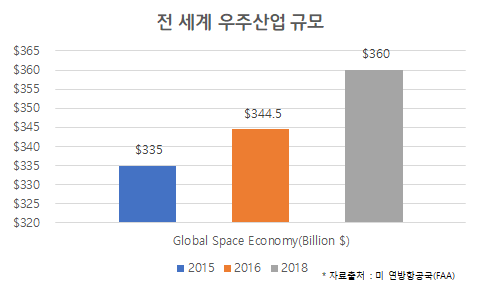

**\<유니 블록 사업 계획서\>**

**1. 회사의 목적**

행성 자원 개발의 가속화와 행성 자원 개발 완료 시의 소유권 분쟁 최소화

**2. 문제와 해결책**

+----------------------------------+----------------------------------+
| **문제**                         | **해결**                         |
+==================================+==================================+
| **1. 공동 유산으로서 행성 사용   | **블록체인의 탈중앙성을 이용한   |
| 결정의 문제**                    | 지구인 참여 네트워크에서의 행성  |
|                                  | 사용 결정**                      |
| 1967년 UN 우주조약 제 2조: 달 및 |                                  |
| 천체는 특정 국가 소유가 아니다.  | 여기서 공유 자원으로서 행성은    |
| 인류의 공동유산이다.             | 특정 국가 혹은 단체 범위의       |
|                                  | 공동이 아닌 지구인 전체의        |
| **공동 유산 문제 해결을 어떻게   | 공동이므로, 지구인 전체가        |
| 해야할까?**                      | 결정권자가 되어 제 3기관 없이    |
|                                  | 합의를 거칠 수 있는 방법이       |
| 노벨 경제학 수상자 엘리너        | 필요하다. 지구인의 공동유산인    |
| 오트름: 공유 자원의 문제는       | 만큼 지구인 모두에게 열린 참여자 |
| 국가나 시장이 해결하는 것이      | 네트워크가 결정권자가 되는       |
| 당연한 것이 아니라, 제3의        | 방식을 통한다.                   |
| 방안으로 자체적으로 해결할 수    |                                  |
| 있다 (\[공유지의 비극을 넘어서\] |                                  |
| 중)                              |                                  |
|                                  |                                  |
| **행성 사용 결정 주체가 한       |                                  |
| 기관이나 국가가 될 수 있을까?\   |                                  |
| ** 공동 유산이기 때문에, 한      |                                  |
| 기관이나 국가가 결정하는 것은    |                                  |
| 정당하지 못하다.                 |                                  |
+----------------------------------+----------------------------------+
| **2. 기존의 행성 소유권 기업과의 | **행성의 소유권이 아닌 행성 자원 |
| 정당성 문제**                    | 소유 기대권 거래 플랫폼 설계**   |
|                                  |                                  |
| **행성은 소유물인가?**           | 현재는 소유물이라고 부를 수 있는 |
|                                  | 행성이 많지 않은 상황이나,       |
| 소유물이 되기 위해선 인간에 의해 | 충분히 미래에 소유물이 될 수는   |
| 관리 감독될 수 있어야 한다.      | 있다. 그렇기에 플랫폼에서        |
| 하지만, 현재 많은 행성들은       | 거래되려고 하는 것들은 "소유권"  |
| 그렇지 못하다. 그렇기에 인간이   | 이 아닌 행성이 관리 가능한       |
| 소유권을 주장할 수 없다.         | 상태가 되었을 때 소유권을 주장할 |
| (대한민국 민법 제 98조:          | 수 있는 권리인 소유 기대권이다.  |
| **[본법](https://ko.wikipedia.   |                                  |
| org/wiki/%EB%AF%BC%EB%B2%95)에서 | 행성 소유 기대권을 소유한 사람은 |
| 물건이라 함은**                  | 지구인 참여 네트워크에 의해 해당 |
| **[유체물                        | 기대권을 공증받고, 블록체인에    |
| ](https://ko.wikipedia.org/w/in  | 남김으로 인해 기대권에 대한      |
| dex.php?title=%EC%9C%A0%EC%B2%B4 | 영속적인 증거를 남길 수 있다.    |
| %EB%AC%BC&action=edit&redlink=1) | 또한, 거래 과정에서 위/변조가    |
| 및**                             | 발생하지 않는다.                 |
| **[전기](https://ko.wikipe       |                                  |
| dia.org/wiki/%EC%A0%84%EA%B8%B0) |                                  |
| 기타**                           |                                  |
| **[관리](https://ko.wikipedi     |                                  |
| a.org/wiki/%EA%B4%80%EB%A6%AC)할 |                                  |
| 수 있는**                        |                                  |
| **[자연력]                       |                                  |
| (https://ko.wikipedia.org/w/inde |                                  |
| x.php?title=%EC%9E%90%EC%97%B0%E |                                  |
| B%A0%A5&action=edit&redlink=1)을 |                                  |
| 말한다. )**                      |                                  |
|                                  |                                  |
| **미래에 행성이 소유물이 될 수   |                                  |
| 있는가?**                        |                                  |
|                                  |                                  |
| 일본 '하야부사'는 토양샘플을     |                                  |
| 채취해 지구로 돌아온 경험이      |                                  |
| 존재, 현재에도 하야부사2를       |                                  |
| 발사했으며 암석을 채취해 지구로  |                                  |
| 2020년에 복귀할 예정이다. 이렇게 |                                  |
| 하야부사처럼 인간에 의해 관리    |                                  |
| 감독 및 사용될 수 있는 행성은    |                                  |
| 소유물의 영역에 들어간다고 볼 수 |                                  |
| 있다.                            |                                  |
|                                  |                                  |
| **이전 소유권을 주장하며 행성    |                                  |
| 판매를 진행한 기업의 정당성      |                                  |
| 문제**                           |                                  |
|                                  |                                  |
| 사례1) 데니스 호프는             |                                  |
| 1980년도부터 달을 포함한 태양계  |                                  |
| 행성에 대해 개인 소유권을        |                                  |
| 주장하면서 1983년부터 달과       |                                  |
| 행성을 판매함.\                  |                                  |
| 사례2) 칠레 변호사 제나로는 칠레 |                                  |
| 정부에 돈을 지불하고 지불하고    |                                  |
| 달을 등기하였다.                 |                                  |
|                                  |                                  |
| 사례1과 2의 문제점: 이들은 UN    |                                  |
| 우주조약의 허점을 이용해 개인의  |                                  |
| 소유로 주장하고 있다. 하지만,    |                                  |
| 행성은 관리 감독이 불가능한      |                                  |
| 물건이므로 '소유권' 자체가       |                                  |
| 성립되지 않으므로, 한 개인이     |                                  |
| 이를 판매하는 것은 정당하지      |                                  |
| 못하다.                          |                                  |
+----------------------------------+----------------------------------+
| **3. 행성 자원 개발 획득의       | **우주산업 개발 가속화 유도**    |
| 현실성 문제**                    |                                  |
|                                  | 개발 성공시에 환급되는           |
|                                  | 이더리움의 동결 해제 갈망과 개인 |
|                                  | STO 구매자들의 견제로 개발       |
|                                  | 성공에 대한 거버넌스 기관들의    |
|                                  | 개발 가속화 의지 제고. ( 제품    |
|                                  | 설명에서 상세히 기술)            |
+----------------------------------+----------------------------------+

**3. 블록체인을 사용해야만 하는 이유**

**탈중앙화 --**

**자료의 영속성 -**

**위변조 불가능 --**

**\
4. 왜 지금인가? & 시장 규모**

**- 우주 산업의 고성장세\
**{width="3.146766185476815in"
height="1.8880599300087488in"}

**- 여러 민간 기업의 우주 산업 참여 가속화**

+----------------------------+----------------------------------------+
| 우주산업기업               | 우주개발 계획                          |
+============================+========================================+
| ESA & JAXA                 | 수성 탐사선 프로젝트 : 베피콜롬보      |
|                            | 탐사선 발사 -\> 수성의 고유자기장과    |
|                            | 자기권, 수성의 표면 지형과 광물,       |
|                            | 화학적 구성 정밀 조사                  |
+----------------------------+----------------------------------------+
| Deep Space Industries(DSI) | 소행성 자원 채굴 목표로 설립, 우주에서 |
|                            | 물, 광물 등의 자원을 채취하여 가공한   |
|                            | 후 지구로 복귀                         |
|                            |                                        |
|                            | 우주 자원을 이용해 지구 궤도를 돌고    |
|                            | 있는 운영중인 우주시스템에 연료 제공   |
|                            | 계획                                   |
+----------------------------+----------------------------------------+
| 블루오리진                 | 우주여행 서비스를 제공하기 위한 로켓   |
|                            | 뉴글렌 및 대형 로켓 엔진인 BE-4 개발   |
+----------------------------+----------------------------------------+
| 스페이스X                  | 화성 식민지 건설계획 : 스타쉽 우주선   |
|                            | 발사 -\> NASA와 협력하여 착륙 후보지   |
|                            | 탐색                                   |
+----------------------------+----------------------------------------+
| 버진갤럭틱                 | 유인우주선 '스페이스십 투'로 3명의     |
|                            | 인원을 쏘아올리는 시험비행 성공,       |
|                            | 우주에서 가치있는 자원을 찾기 위한     |
|                            | 시도 계획                              |
+----------------------------+----------------------------------------+

**행성 자원에서 실질적인 이득을 얻으려는 투자와 민간 거업들의 참여가
늘어나고 있다. 이를 고려해 보았을 때, 참여자 네트워크를 통해서 행성 자원
소유 기대권을 공증하고 이의 영속적인 증거가 보장되는 플랫폼이
만들어진다면 많은 거래 희망자가 생길 거라고 예측된다.**

**5. 제품**

**- 행성 자원 소유 기대권 플랫폼 흐름도**

{width="6.26875in" height="3.522222222222222in"}

1\) 행성 등록

2\) 개발권 경매

3\) 행성 자원 소유 기대권 P2P 거래
